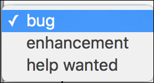
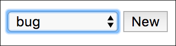
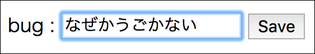

これは[システムエンジニア Advent Calendar 2016](http://qiita.com/advent-calendar/2016/se)の17日目です。

16日目はうがさんの[非SPAのWebアプリケーションで局所的にSPAを適用する際のポイント](http://qiita.com/uggds/items/1baf844e8fb1dc7c4b09)でした。
早速、次の案件で参考にしたくなったタイムリーな内容でした！

## hiddenフィールドの値のチェック

なにかを登録する画面で値を引き回したいときにhiddenフィールドに埋め込んで、登録時にその値が合ってんのか？ってチェックをすると思います。

例えば、カテゴリーを選択して、新しいIssue作成画面を開いて、内容を書いてsubmitみたいなアプリケーションがあるとします。



⬇︎



⬇︎



登録画面では[カテゴリーのIDをhiddenフィールドに埋め込んでいます](https://github.com/backpaper0/seac2016/blob/no-hmac/src/main/resources/templates/new-issue.html)。

```html
<input type="text" name="content"/>
<input type="hidden" name="categoryId" data-th-value="${category.id}"/>
<button type="submit">Save</button>
```

登録処理では[この値がカテゴリーのテーブルに存在するかチェックしています](https://github.com/backpaper0/seac2016/blob/no-hmac/src/main/java/com/example/IssueController.java#L50)。

```java
@PostMapping("new")
String post(@RequestParam String content, @RequestParam Long categoryId) {

    //登録時にもう一回存在チェック
    categoryDao.selectById(categoryId).orElseThrow(BadRequest::new);

    Issue entity = new Issue();
    entity.content = content;
    entity.categoryId = categoryId;
    issueDao.insert(entity);
    return "redirect:/";
}
```

このチェックがですね、DBアクセスするから微妙に負荷高そうだし、チェックしないといけない値がもっと増えたら面倒だなー、ってずっと思っていました。
だいたい、登録画面を表示するときにカテゴリーを検索して得た値を埋め込んでるのに、なんで登録処理でも存在チェックしないといけないんだ！って感じです。

とはいえ、HTMLを書き換えたらありえない値もsubmitできるし、ちゃんとチェックしないとダメです。

そこで、HMACを使った値のチェックを考えてみました。

## HMACとは

鍵付きのハッシュです。
値を知っていても鍵を知らないとハッシュ値を得られません。
また、同じ値をハッシュしたとしても鍵が異なれば異なるハッシュ値を得ます。
詳しくはググってちょ。

## HMACで値のチェックをする

DBアクセスしてカテゴリの存在チェックを行っていた箇所をHMACを使ったチェックに変更します。

まず、登録画面を開くときに[カテゴリーのIDをHMACでハッシュ](https://github.com/backpaper0/seac2016/blob/hmac-verify/src/main/java/com/example/IssueController.java#L47)して、[その値をビューに埋め込みます](https://github.com/backpaper0/seac2016/blob/hmac-verify/src/main/resources/templates/new-issue.html#L14)。

```java
@GetMapping("new")
String blank(Model model, @RequestParam Long categoryId) throws GeneralSecurityException {

    //Categoryの存在チェック
    Category category = categoryDao.selectById(categoryId).orElseThrow(BadRequest::new);

    //ハッシュ作ってhiddenフィールドで埋め込む
    String hash = verifier.hash(categoryId);

    model.addAttribute("category", category);
    model.addAttribute("hash", hash);
    return "new-issue";
}
```

```html
<input type="text" name="content"/>
<input type="hidden" name="categoryId" data-th-value="${category.id}"/>
<input type="hidden" name="hash" data-th-value="${hash}"/>
<button type="submit">Save</button>
```

[ハッシュ処理はこんな感じ](https://github.com/backpaper0/seac2016/blob/hmac-verify/src/main/java/com/example/Verifier.java#L19)。

```java
public String hash(Long value) throws GeneralSecurityException {
    Mac mac = Mac.getInstance("HmacSHA256");
    mac.init(key);
    byte[] hash = mac.doFinal(String.valueOf(value).getBytes());
    return IntStream.range(0, hash.length).mapToObj(i -> String.format("%02x", hash[i]))
            .collect(Collectors.joining());
}
```

登録処理では、[submitされたカテゴリーIDをHMACでハッシュして、同じくsubmitされたハッシュ値と比較します](https://github.com/backpaper0/seac2016/blob/hmac-verify/src/main/java/com/example/IssueController.java#L60)。

```java
if (verifier.verify(hash, categoryId) == false) {
    throw new BadRequest();
}
```

これで存在チェックと同じように、値の改変を防ぐためのチェックができました。

## メリット

* DBアクセスの必要がなく、チェック処理がJVM上で完結する
* 種類の異なる複数の値があってもチェックの方法が同じ

ちなみに、複数の値がある場合はすべての値を`:`なり`.`なりで繋いでハッシュすればハッシュ値は1つで済むのでHTTPリクエスト・レスポンスのペイロードも膨れません。

## 注意点

厳密な存在チェックではないので、登録画面を表示したときにはあったカテゴリーが登録処理時になくなっていたら不整合が起こります。(サンプルでは`foreign key`制約で防いでいますが)

そのため、日中は変わらないデータ（例えば、業務システムなら部門とか）に対してのみ行うとか、適用するところは気をつけないといけないです。

また、上記のような理由で日を跨いだらハッシュ値を無効にしたい場合があると思います。
その場合は[日付も一緒にハッシュする](https://github.com/backpaper0/seac2016/blob/master/src/main/java/com/example/Verifier.java#L24)と良いでしょう。
このように、タイムスタンプを一緒にハッシュすると有効期限を持たせられますし、セッションIDあたりを一緒にハッシュするとユーザー毎に有効なハッシュを作れます。

その他の注意点として、鍵の管理があります。
アプリケーション起動時にランダムな値を取得してそれを鍵としてもいいですが、冗長構成をとってアプリケーションのインスタンスが複数ある場合はスティッキーセッションを有効にするか、すべてのインスタンス間で鍵を共有する必要があります。
どういう管理をするかはケースバイケースとは思います。

## まとめ

hiddenフィールドに埋め込んだ値の妥当性チェックにHMACを使う方法を考えてみました。
注意点はありますが、適用できる場面は多いだろうと思っています。

サンプルコードはGitHubに置いています。

* https://github.com/backpaper0/seac2016

DBを使った存在チェックをしている[no-hmac](https://github.com/backpaper0/seac2016/tree/no-hmac)ブランチ、HMACでチェックをしている[hmac-verify](https://github.com/backpaper0/seac2016/tree/hmac-verify)ブランチ、それからハッシュに日付を混ぜ込んで有効期限を設定している[master](https://github.com/backpaper0/seac2016)ブランチがありますので、それぞれ見比べてみてください。

以上⛄️
